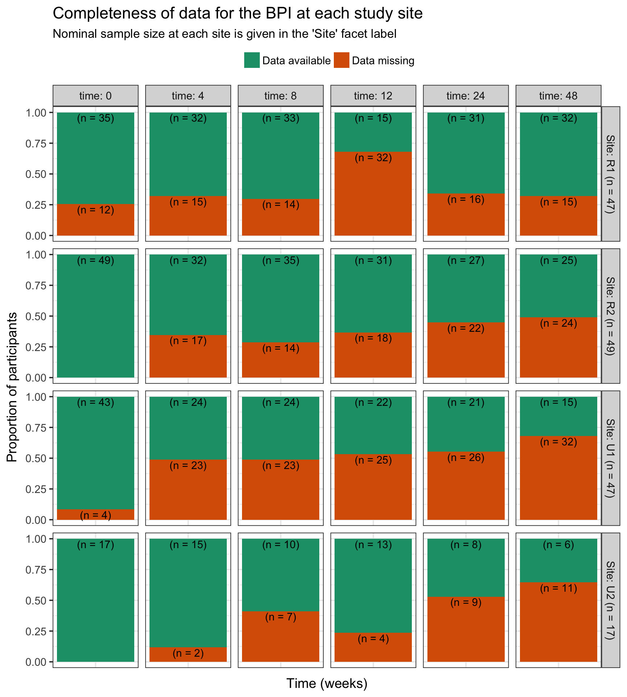
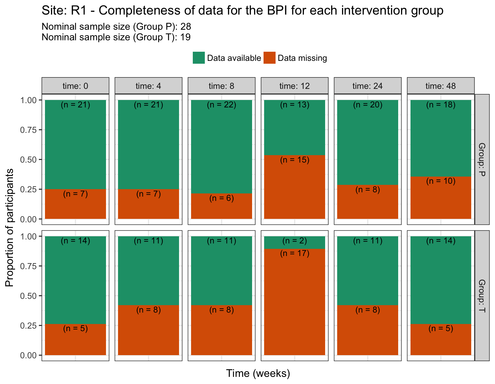
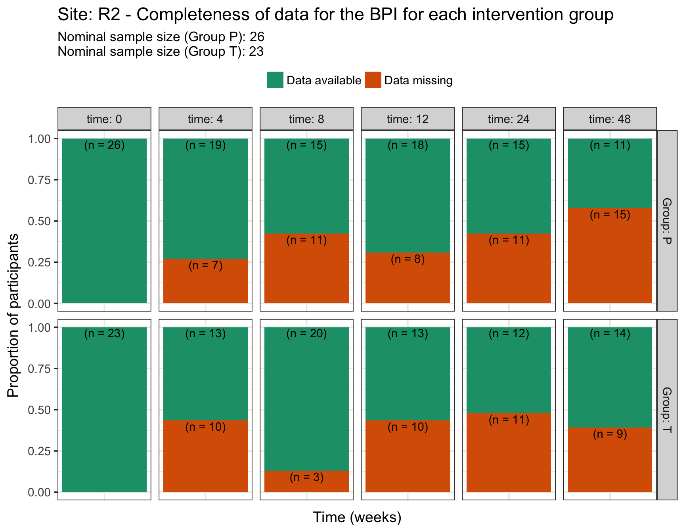
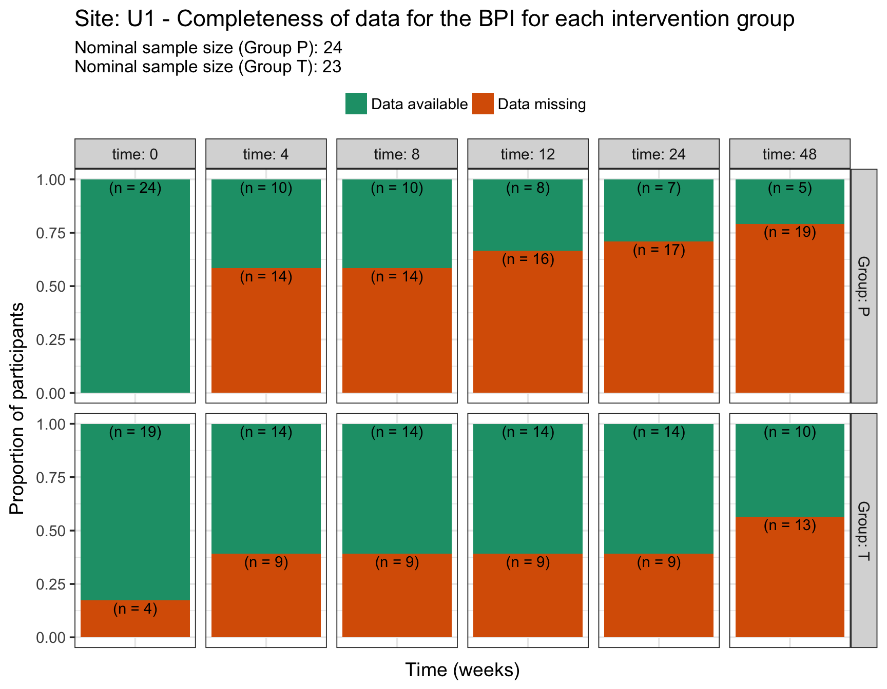
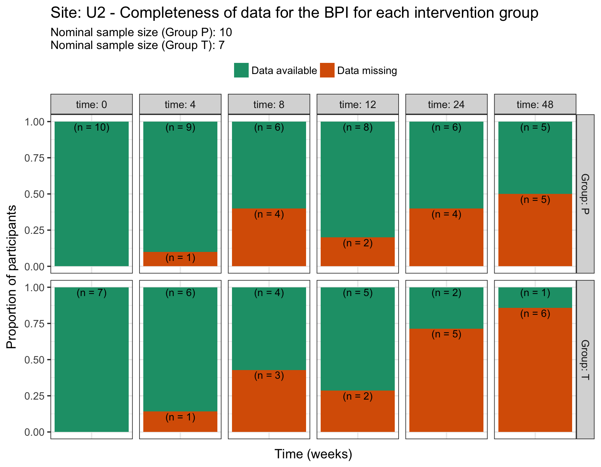
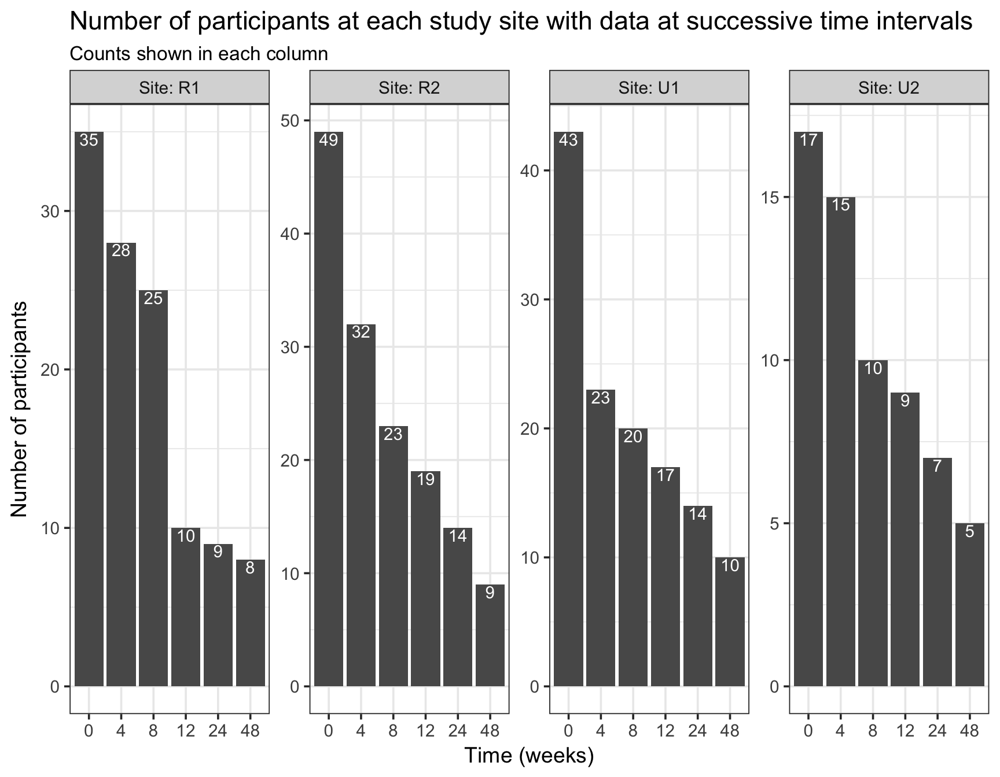
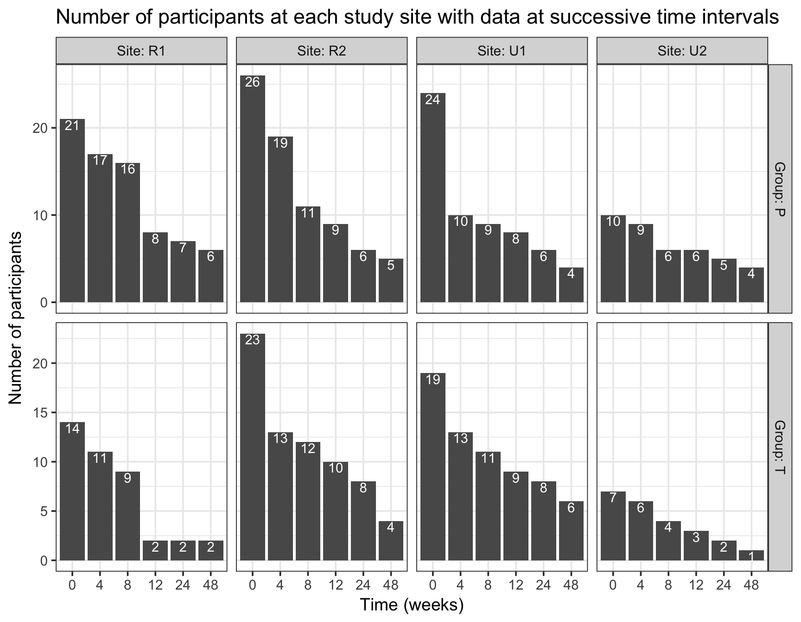
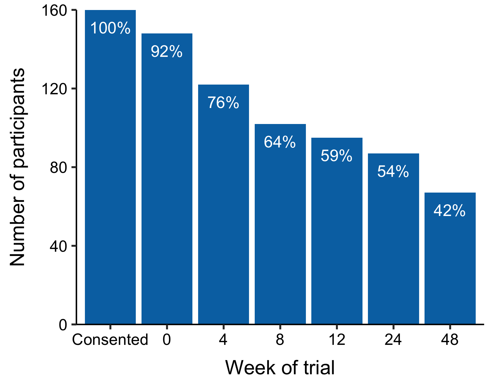
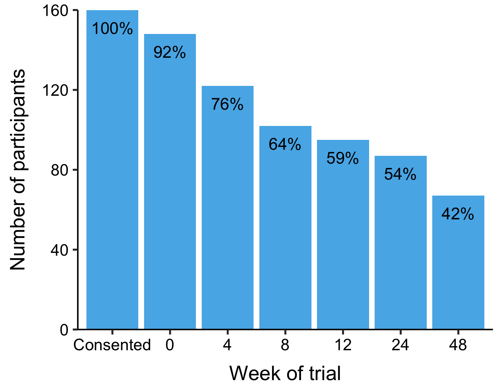
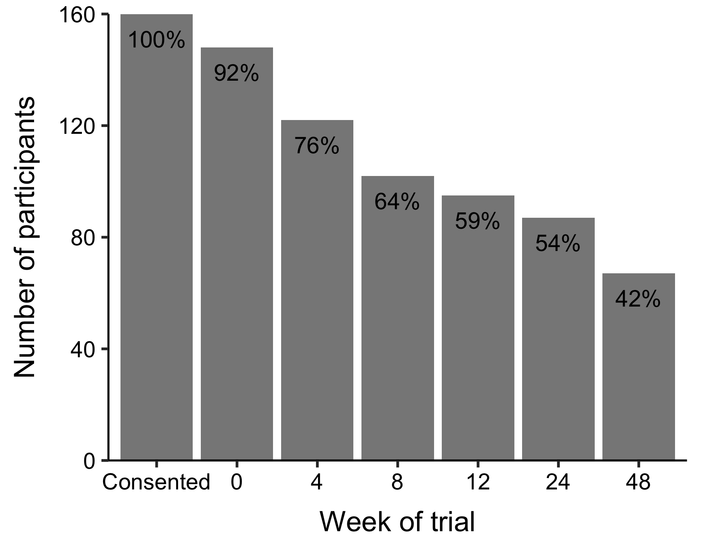

Data completeness
================
Peter Kamerman

Description
-----------

A descriptive analysis of the completeness of data across the 48 weeks of the trial.

Because the Brief Pain Inventory (BPI) was used to collect the primary outcome measure for the study (pain intensity), we assummed the BPI would provide the most representative index of completion rates.

**Note: Participant consent did not provide for the publication of their data, and hence neither the original nor cleaned data have been made available. However, we do not wish to bar access to the data unnecessarily and we will judge requests to access the data on a case-by-case basis. Examples of potential use cases include independent assessments of our analyses, and secondary data analyses. Please contact Prof Romy Parker (<romy.parker@uct.ac.za>), Dr Antonia Wadley (<antonia.wadley@wits.ac.za>), or open an [*issue*](https://github.com/kamermanpr/HIP-supplement/issues) on this repo.**

Setup
-----

``` r
# Load packages
library(tidyverse)
library(magrittr)
library(skimr)

# Set ggplot2 theme
theme_set(new = theme_bw(base_size = 14))

# Set knitr options
knitr::opts_chunk$set(warning = FALSE,
                      message = FALSE,
                      fig.retina = 2,
                      fig.align = 'center',
                      fig.path = '../outputs/figures/data-completeness/',
                      fig.width = 9,
                      fig.height = 7)
```

Import data
-----------

``` r
# Read in bpi data
bpi <- read_rds('../data/bpi.rds') 

# Read in site and group info
foo <- read_rds('../data/demographics.rds') %>%
    select(ID, Site, Group)

# Join the two datasets 
bpi %<>%
    left_join(foo)

# Remove foo
rm(foo)
```

Tabular summary of completeness
-------------------------------

This summary ignores study site and intervention group stratification.

``` r
bpi %>% 
    # Remove unneeded columns
    select(-contains('_rx'), -ID, -Site, -Group) %>% 
    # Skim to a df
    skim_to_wide() %>% 
    # Choose required columns 
    select(variable, missing, complete, n) %>%
    # Process df to make it more informative
    separate(col = variable,
             into = c('variable', 'time'),
             sep = '\\.') %>% 
    mutate(subscale = case_when(
        variable == 'Pain_present' ~ 'Pain_present',
        variable == 'Worst_pain' | 
            variable == 'Least_pain' |
            variable == 'Pain_now' |
            variable == 'Average_pain'  ~ 'Pain_intensity',
        variable == 'Mood' | 
            variable == 'Sleep' |
            variable == 'Activities_of_daily_living' |
            variable == 'Enjoyment_of_life' |
            variable == 'Relationship_with_others' |
            variable == 'Walking' |
            variable == 'Work' ~ 'Pain_interference'
    )) %>% 
    mutate(subscale = factor(subscale,
                             levels = c('Pain_present', 
                                        'Pain_intensity',
                                        'Pain_interference'),
                             ordered = TRUE),
           time = factor(time,
                         levels = c('BL', 'Wk4', 'Wk8', 
                                    'Wk12', 'Wk24', 'Wk48'),
                         ordered = TRUE)) %>% 
    select(variable, time, subscale, missing, complete, n) %>% 
    arrange(time, subscale) %>% 
    # Tabulate
    kable(caption = 'Tabular summary of data completeness')
```

| variable                      | time | subscale           | missing | complete | n   |
|:------------------------------|:-----|:-------------------|:--------|:---------|:----|
| Pain\_present                 | BL   | Pain\_present      | 16      | 144      | 160 |
| Average\_pain                 | BL   | Pain\_intensity    | 51      | 109      | 160 |
| Least\_pain                   | BL   | Pain\_intensity    | 16      | 144      | 160 |
| Pain\_now                     | BL   | Pain\_intensity    | 16      | 144      | 160 |
| Worst\_pain                   | BL   | Pain\_intensity    | 16      | 144      | 160 |
| Activities\_of\_daily\_living | BL   | Pain\_interference | 18      | 142      | 160 |
| Enjoyment\_of\_life           | BL   | Pain\_interference | 17      | 143      | 160 |
| Mood                          | BL   | Pain\_interference | 18      | 142      | 160 |
| Relationship\_with\_others    | BL   | Pain\_interference | 19      | 141      | 160 |
| Sleep                         | BL   | Pain\_interference | 17      | 143      | 160 |
| Walking                       | BL   | Pain\_interference | 17      | 143      | 160 |
| Work                          | BL   | Pain\_interference | 17      | 143      | 160 |
| Pain\_present                 | Wk4  | Pain\_present      | 57      | 103      | 160 |
| Average\_pain                 | Wk4  | Pain\_intensity    | 89      | 71       | 160 |
| Least\_pain                   | Wk4  | Pain\_intensity    | 58      | 102      | 160 |
| Pain\_now                     | Wk4  | Pain\_intensity    | 57      | 103      | 160 |
| Worst\_pain                   | Wk4  | Pain\_intensity    | 57      | 103      | 160 |
| Activities\_of\_daily\_living | Wk4  | Pain\_interference | 57      | 103      | 160 |
| Enjoyment\_of\_life           | Wk4  | Pain\_interference | 57      | 103      | 160 |
| Mood                          | Wk4  | Pain\_interference | 58      | 102      | 160 |
| Relationship\_with\_others    | Wk4  | Pain\_interference | 57      | 103      | 160 |
| Sleep                         | Wk4  | Pain\_interference | 57      | 103      | 160 |
| Walking                       | Wk4  | Pain\_interference | 57      | 103      | 160 |
| Work                          | Wk4  | Pain\_interference | 58      | 102      | 160 |
| Pain\_present                 | Wk8  | Pain\_present      | 58      | 102      | 160 |
| Average\_pain                 | Wk8  | Pain\_intensity    | 91      | 69       | 160 |
| Least\_pain                   | Wk8  | Pain\_intensity    | 58      | 102      | 160 |
| Pain\_now                     | Wk8  | Pain\_intensity    | 58      | 102      | 160 |
| Worst\_pain                   | Wk8  | Pain\_intensity    | 59      | 101      | 160 |
| Activities\_of\_daily\_living | Wk8  | Pain\_interference | 58      | 102      | 160 |
| Enjoyment\_of\_life           | Wk8  | Pain\_interference | 58      | 102      | 160 |
| Mood                          | Wk8  | Pain\_interference | 58      | 102      | 160 |
| Relationship\_with\_others    | Wk8  | Pain\_interference | 58      | 102      | 160 |
| Sleep                         | Wk8  | Pain\_interference | 58      | 102      | 160 |
| Walking                       | Wk8  | Pain\_interference | 58      | 102      | 160 |
| Work                          | Wk8  | Pain\_interference | 58      | 102      | 160 |
| Pain\_present                 | Wk12 | Pain\_present      | 79      | 81       | 160 |
| Average\_pain                 | Wk12 | Pain\_intensity    | 94      | 66       | 160 |
| Least\_pain                   | Wk12 | Pain\_intensity    | 79      | 81       | 160 |
| Pain\_now                     | Wk12 | Pain\_intensity    | 79      | 81       | 160 |
| Worst\_pain                   | Wk12 | Pain\_intensity    | 79      | 81       | 160 |
| Activities\_of\_daily\_living | Wk12 | Pain\_interference | 79      | 81       | 160 |
| Enjoyment\_of\_life           | Wk12 | Pain\_interference | 79      | 81       | 160 |
| Mood                          | Wk12 | Pain\_interference | 79      | 81       | 160 |
| Relationship\_with\_others    | Wk12 | Pain\_interference | 79      | 81       | 160 |
| Sleep                         | Wk12 | Pain\_interference | 79      | 81       | 160 |
| Walking                       | Wk12 | Pain\_interference | 79      | 81       | 160 |
| Work                          | Wk12 | Pain\_interference | 78      | 82       | 160 |
| Pain\_present                 | Wk24 | Pain\_present      | 73      | 87       | 160 |
| Average\_pain                 | Wk24 | Pain\_intensity    | 104     | 56       | 160 |
| Least\_pain                   | Wk24 | Pain\_intensity    | 73      | 87       | 160 |
| Pain\_now                     | Wk24 | Pain\_intensity    | 73      | 87       | 160 |
| Worst\_pain                   | Wk24 | Pain\_intensity    | 73      | 87       | 160 |
| Activities\_of\_daily\_living | Wk24 | Pain\_interference | 73      | 87       | 160 |
| Enjoyment\_of\_life           | Wk24 | Pain\_interference | 74      | 86       | 160 |
| Mood                          | Wk24 | Pain\_interference | 73      | 87       | 160 |
| Relationship\_with\_others    | Wk24 | Pain\_interference | 73      | 87       | 160 |
| Sleep                         | Wk24 | Pain\_interference | 73      | 87       | 160 |
| Walking                       | Wk24 | Pain\_interference | 75      | 85       | 160 |
| Work                          | Wk24 | Pain\_interference | 74      | 86       | 160 |
| Pain\_present                 | Wk48 | Pain\_present      | 82      | 78       | 160 |
| Average\_pain                 | Wk48 | Pain\_intensity    | 114     | 46       | 160 |
| Least\_pain                   | Wk48 | Pain\_intensity    | 82      | 78       | 160 |
| Pain\_now                     | Wk48 | Pain\_intensity    | 82      | 78       | 160 |
| Worst\_pain                   | Wk48 | Pain\_intensity    | 82      | 78       | 160 |
| Activities\_of\_daily\_living | Wk48 | Pain\_interference | 82      | 78       | 160 |
| Enjoyment\_of\_life           | Wk48 | Pain\_interference | 82      | 78       | 160 |
| Mood                          | Wk48 | Pain\_interference | 82      | 78       | 160 |
| Relationship\_with\_others    | Wk48 | Pain\_interference | 82      | 78       | 160 |
| Sleep                         | Wk48 | Pain\_interference | 82      | 78       | 160 |
| Walking                       | Wk48 | Pain\_interference | 82      | 78       | 160 |
| Work                          | Wk48 | Pain\_interference | 83      | 77       | 160 |

Although there are small variations in the number of missing data across BPI items, the first item on the BDI assesses whether the participant has pain at the time of completing the questionniare (`Pain_present`), and it will be used as a proxy of missing data across all other items.

Note that `Average_pain` values are greater because average pain data were not recorded at the *R1* site (n = 47).

Clean data
----------

``` r
# Gather into long format and process time/question column
bpi %<>%
    select(ID, Site, Group, starts_with('Pain_present')) %>% 
    gather(key = question,
           value = answer,
           -ID, - Site, - Group) %>%
    # Separate pain_question into constituent parts
    separate(col = question, 
             into = c('question', 'time'),
             sep = '\\.') %>%
    # Convert time points to integer
    ungroup() %>%
    mutate(time = str_replace(string = time, 
                              pattern = 'Wk',
                              replacement = ''),
           time = str_replace(string = time, 
                              pattern = 'BL',
                              replacement = '0'),
           time = as.integer(time)) 
```

Graphical summaries of completeness
-----------------------------------

These summaries are stratified by study site, and study site and intervention group.

#### Study site

``` r
bpi %>%
    # Code whether data in bdi_rating is missing or not
    mutate(coding = ifelse(is.na(answer), 
                           yes = 'Data missing',
                           no = 'Data available')) %>% 
    # Get nominal sample size for each site
    group_by(Site, time) %>% 
    mutate(sample_size = n()) %>%
    ungroup() %>% 
    mutate(Site = paste0(Site, ' (n = ', sample_size, ')')) %>% 
    # Plot
    ggplot(data = .) +
    aes(x = question) +
    geom_bar(aes(fill = coding),
             position = position_fill()) +
    geom_text(position = position_fill(), 
              stat = 'count', 
              aes(group = coding,
                  label = paste0('(n = ', ..count.., ')')),
              vjust = 1.2) +
    labs(title = 'Completeness of data for the BPI at each study site',
         subtitle = "Nominal sample size at each site is given in the 'Site' facet label",
         x = 'Time (weeks)',
         y = 'Proportion of participants') +
    scale_fill_brewer(type = 'qual', 
                      palette = 'Dark2') +
    facet_grid(Site ~ time,
               labeller = label_both) +
    theme(legend.position = 'top',
          legend.title = element_blank(),
          axis.text.x = element_blank(),
          axis.ticks.x = element_blank())
```



#### Study site and intervention group

``` r
complete_group <- bpi %>%
    # Code whether data in bdi_rating is missing or not
    mutate(coding = ifelse(is.na(answer), 
                           yes = 'Data missing',
                           no = 'Data available')) %>% 
    # Nest
    group_by(Site) %>% 
    nest() %>% 
    arrange(Site) %>%
    # Calculate nominal number of participants per Site
    mutate(summary_p = map(.x = data,
                           ~ filter(.data = .x, 
                                    Group == 'P') %>%
                               summarise(count = as.integer(
                                   sum(!is.na(ID)) / 6))),
           summary_t = map(.x = data,
                           ~ filter(.data = .x, 
                                    Group == 'T') %>% 
                               summarise(count = as.integer(
                                   sum(!is.na(ID)) / 6)))) %>% 
    # Plot data
    mutate(plot = pmap(.l = list(data, Site, 
                                 summary_p, summary_t),
                       ~ ggplot(data = ..1) +
                           aes(x = question,
                               fill = coding) +
                           geom_bar(position = position_fill()) +
                           geom_text(position = position_fill(), 
                                     stat = 'count', 
                                     aes(label = paste0('(n = ', ..count.., ')')),
                                     vjust = 1.2) +
                           labs(title = str_glue('Site: {..2} - Completeness of data for the BPI for each intervention group'),
                                subtitle = str_glue('Nominal sample size (Group P): {..3}\nNominal sample size (Group T): {..4}'),
                                x = 'Time (weeks)',
                                y = 'Proportion of participants') +
                           scale_fill_brewer(type = 'qual', 
                                             palette = 'Dark2') +
                           facet_grid(Group ~ time, 
                                      labeller = label_both) +
                           theme(legend.position = 'top',
                                 legend.title = element_blank(),
                                 axis.text.x = element_blank(),
                                 axis.ticks.x = element_blank()))) 

# Print output
walk(.x = complete_group$plot, ~ print(.x))
```



Continuous data collection
--------------------------

The number of participants with data across successive time points.

#### Prepare data

``` r
bpi_successive <- bpi %>% 
    # Recode the answer data to numeric (yes and no are legitimate answers)
    mutate(answer_numeric = case_when(
        answer == 'Yes' ~ '1',
        answer == 'No' ~ '1'
    ),
    answer_numeric = as.integer(answer_numeric)) %>% 
    # Generate the counts across time
    group_by(ID) %>% 
    mutate(cumulative_data = cumsum(answer_numeric)) 
```

#### Study site

``` r
bpi_successive %>%     
    group_by(Site, time, ID) %>% 
    summarise(count = sum(!is.na(cumulative_data))) %>% 
    ungroup() %>% 
    # Filter for counts > 0
    filter(count > 0) %>% 
    # Recount by Site and time
    group_by(Site, time) %>% 
    summarise(count = n()) %>% 
    ungroup() %>% 
    # Plot
    ggplot(data = .) +
    aes(x = factor(time), 
        y = count) +
    geom_bar(stat = 'identity') +
    geom_text(aes(label = count),
              vjust = 1.1,
              colour = '#FFFFFF') +
    labs(title = 'Number of participants at each study site with data at successive time intervals',
         subtitle = 'Counts shown in each column',
         x = 'Time (weeks)',
         y = 'Number of participants') +
    facet_wrap(~ Site,
               ncol = 4,
               labeller = label_both,
               scales = 'free_y')
```



#### Study site and intervention group

``` r
bpi_successive %>%     
    group_by(Site, Group, time, ID) %>% 
    summarise(count = sum(!is.na(cumulative_data))) %>% 
    ungroup() %>% 
    # Filter for counts > 0
    filter(count > 0) %>% 
    # Recount by Site and time
    group_by(Site, Group, time) %>% 
    summarise(count = n()) %>% 
    ungroup() %>% 
    # Plot
    ggplot(data = .) +
    aes(x = factor(time), 
        y = count) +
    geom_bar(stat = 'identity') +
    geom_text(aes(label = count),
              colour = '#FFFFFF',
              vjust = 1.1) +
    labs(title = 'Number of participants at each study site with data at successive time intervals',
         x = 'Time (weeks)',
         y = 'Number of participants') +
    facet_grid(Group ~ Site,
               labeller = label_both,
               scales = 'free_y')
```



Summary
-------

Other than site *R1*, the other sites have 100% or near 100% (*U1*) records at baseline (time = 0 weeks), thereafter, there is a trend for progressively more incomplete data over time.

The number of participants with continuous data over successive reassessment time-points shows substantial drop-off over the 48 weeks.

Manuscript plot
---------------

A figure of loss to follow-up for publication purposes.

The 'completeness' plots above catalogued whether data from each participant were missing/available at each time interval without being sensitive to whether participants returned or did not return for reassessment at subsequent time-points. In this analysis, participants were classified as *'lost to follow-up'* when they had ≥ 2 succesive time-points (or week 48 was reached) with missing data, with the time of loss to follow-up being taken as the last time-point for which data were available.

To accomodate erratic attendance at the baseline assessment and subsequent reassessment time-points, we extended our *'lost to follow-up'* classification to include the following:

-   Participants who were recruited, but failed to attend the baseline and week 8 assessments were classified as being lost to follow-up at *-T0*, irrespective of whether they were assessed at other time-points.

-   Participants that missed the baseline assessment, but who were reassessed at least at week 8 were classified as lost to follow-up according to the ≥ 2 successive missed reassessment rule, but starting at week 8.

``` r
# Spread data
bpi_spread <- bpi %>%
    # Code whether data coding data are missing or not
    mutate(coding = ifelse(is.na(answer), 
                           yes = '0',
                           no = '1')) %>% 
    mutate(coding = as.numeric(coding)) %>% 
    select(-answer) %>% 
    # Recode time before spreading
    mutate(time = paste0('T', time)) %>% 
    # Spread time columns
    spread(key = time,
           value = coding) %>% 
    select(ID, T0, T4, T8, T12, T24, T48) %>% 
    arrange(T0, T4, T8, T12, T24, T48)

# Get unique combinations
bpi_spread %<>% 
    group_by(ID) %>% 
    mutate(combos = paste(T0, T4, T8, T12, T24, T48, collapse = ' '))

# Check the combinations
bpi_spread %>%
    .$combos %>% 
    unique(.) %>%
    data.frame(combos = .)
```

    ##         combos
    ## 1  0 0 0 0 0 0
    ## 2  0 0 0 0 0 1
    ## 3  0 0 0 0 1 0
    ## 4  0 0 0 0 1 1
    ## 5  0 1 0 1 1 1
    ## 6  0 1 1 0 1 1
    ## 7  0 1 1 1 0 0
    ## 8  0 1 1 1 1 0
    ## 9  0 1 1 1 1 1
    ## 10 1 0 0 0 0 0
    ## 11 1 0 0 0 0 1
    ## 12 1 0 0 1 0 0
    ## 13 1 0 0 1 1 1
    ## 14 1 0 1 0 0 0
    ## 15 1 0 1 0 0 1
    ## 16 1 0 1 0 1 1
    ## 17 1 0 1 1 0 1
    ## 18 1 0 1 1 1 0
    ## 19 1 0 1 1 1 1
    ## 20 1 1 0 0 0 0
    ## 21 1 1 0 0 0 1
    ## 22 1 1 0 0 1 0
    ## 23 1 1 0 0 1 1
    ## 24 1 1 0 1 0 0
    ## 25 1 1 0 1 0 1
    ## 26 1 1 0 1 1 0
    ## 27 1 1 1 0 0 0
    ## 28 1 1 1 0 0 1
    ## 29 1 1 1 0 1 0
    ## 30 1 1 1 0 1 1
    ## 31 1 1 1 1 0 0
    ## 32 1 1 1 1 0 1
    ## 33 1 1 1 1 1 0
    ## 34 1 1 1 1 1 1

``` r
# Manually specify combos (need to find a way of automating this)
# 
# The case_when booleans assign participants with the last visit at which 
# they had data recorded (i.e., data missing from future time-points). 
# 
# Gaps in data have been allowed for, so missing a visit did not result in a 
# participant being marked a lost to follow-up at future dates, if they returned 
# at some point.  
#
# People without week 8 data (T8) and no baseline data (T0) were coded as -T0 
# (i.e., recruited and consented, but did not take part in the study). 

bpi_spread %<>%
    mutate(Time_of_loss = case_when(
        T0 == '0' & T4 == '0' & T8 == '0' & T12 == '0' & T24 == '0' & T48 == '0' ~ '-T0',
        T0 == '0' & T4 == '0' & T8 == '0' & T12 == '0' & T24 == '0' & T48 == '1' ~ '-T0',
        T0 == '0' & T4 == '0' & T8 == '0' & T12 == '0' & T24 == '1' & T48 == '0' ~ '-T0',
        T0 == '0' & T4 == '0' & T8 == '0' & T12 == '0' & T24 == '1' & T48 == '1' ~ '-T0',
        T0 == '0' & T4 == '1' & T8 == '0' & T12 == '1' & T24 == '1' & T48 == '1' ~ '-T0',
        T0 == '0' & T4 == '1' & T8 == '1' & T12 == '0' & T24 == '1' & T48 == '1' ~ 'T48',
        T0 == '0' & T4 == '1' & T8 == '1' & T12 == '1' & T24 == '0' & T48 == '0' ~ 'T12',
        T0 == '0' & T4 == '1' & T8 == '1' & T12 == '1' & T24 == '1' & T48 == '0' ~ 'T24',
        T0 == '0' & T4 == '1' & T8 == '1' & T12 == '1' & T24 == '1' & T48 == '1' ~ 'T48',
        T0 == '1' & T4 == '0' & T8 == '0' & T12 == '0' & T24 == '0' & T48 == '0' ~ 'T0',
        T0 == '1' & T4 == '0' & T8 == '0' & T12 == '0' & T24 == '0' & T48 == '1' ~ 'T0',
        T0 == '1' & T4 == '0' & T8 == '0' & T12 == '1' & T24 == '0' & T48 == '0' ~ 'T0',
        T0 == '1' & T4 == '0' & T8 == '0' & T12 == '1' & T24 == '1' & T48 == '1' ~ 'T0',
        T0 == '1' & T4 == '0' & T8 == '1' & T12 == '0' & T24 == '0' & T48 == '0' ~ 'T8',
        T0 == '1' & T4 == '0' & T8 == '1' & T12 == '0' & T24 == '0' & T48 == '1' ~ 'T48',
        T0 == '1' & T4 == '0' & T8 == '1' & T12 == '0' & T24 == '1' & T48 == '1' ~ 'T48',
        T0 == '1' & T4 == '0' & T8 == '1' & T12 == '1' & T24 == '0' & T48 == '1' ~ 'T48',
        T0 == '1' & T4 == '0' & T8 == '1' & T12 == '1' & T24 == '1' & T48 == '0' ~ 'T24',
        T0 == '1' & T4 == '0' & T8 == '1' & T12 == '1' & T24 == '1' & T48 == '1' ~ 'T48',
        T0 == '1' & T4 == '1' & T8 == '0' & T12 == '0' & T24 == '0' & T48 == '0' ~ 'T4',
        T0 == '1' & T4 == '1' & T8 == '0' & T12 == '0' & T24 == '0' & T48 == '1' ~ 'T4',
        T0 == '1' & T4 == '1' & T8 == '0' & T12 == '0' & T24 == '1' & T48 == '0' ~ 'T4',
        T0 == '1' & T4 == '1' & T8 == '0' & T12 == '0' & T24 == '1' & T48 == '1' ~ 'T4',
        T0 == '1' & T4 == '1' & T8 == '0' & T12 == '1' & T24 == '0' & T48 == '0' ~ 'T4',
        T0 == '1' & T4 == '1' & T8 == '0' & T12 == '1' & T24 == '0' & T48 == '1' ~ 'T4',
        T0 == '1' & T4 == '1' & T8 == '0' & T12 == '1' & T24 == '1' & T48 == '0' ~ 'T4',
        T0 == '1' & T4 == '1' & T8 == '1' & T12 == '0' & T24 == '0' & T48 == '0' ~ 'T8',
        T0 == '1' & T4 == '1' & T8 == '1' & T12 == '0' & T24 == '0' & T48 == '1' ~ 'T48',
        T0 == '1' & T4 == '1' & T8 == '1' & T12 == '0' & T24 == '1' & T48 == '0' ~ 'T24',
        T0 == '1' & T4 == '1' & T8 == '1' & T12 == '0' & T24 == '1' & T48 == '1' ~ 'T48',
        T0 == '1' & T4 == '1' & T8 == '1' & T12 == '1' & T24 == '0' & T48 == '0' ~ 'T12',
        T0 == '1' & T4 == '1' & T8 == '1' & T12 == '1' & T24 == '0' & T48 == '1' ~ 'T48',
        T0 == '1' & T4 == '1' & T8 == '1' & T12 == '1' & T24 == '1' & T48 == '0' ~ 'T24',
        T0 == '1' & T4 == '1' & T8 == '1' & T12 == '1' & T24 == '1' & T48 == '1' ~ 'T48'
        ))

# Tabulate
bpi_spread %>% 
    group_by(combos, Time_of_loss) %>%
    summarise(count = n()) %>% 
    ungroup() %>% 
    mutate(Time_of_loss = factor(Time_of_loss,
                                 levels = c('-T0', 'T0', 'T4', 'T8', 
                                            'T12', 'T24', 'T48'),
                                 ordered = TRUE)) %>% 
    arrange(Time_of_loss, desc(count)) %>% 
    mutate(combos = str_replace_all(combos,
                                    pattern = '0',
                                    replacement = '_'),
           combos = str_replace_all(combos,
                                    pattern = '1',
                                    replacement = 'A')) %>% 
    knitr::kable(.,
                 caption = '',
                 col.names = c('Attendance sequence', 
                               'Lost to follow-up classification',
                               'Number of participants'),
                 align = 'rrr')
```

|  Attendance sequence|  Lost to follow-up classification|  Number of participants|
|--------------------:|---------------------------------:|-----------------------:|
|    \_ \_ \_ \_ \_ \_|                               -T0|                       8|
|     \_ \_ \_ \_ \_ A|                               -T0|                       1|
|     \_ \_ \_ \_ A \_|                               -T0|                       1|
|      \_ \_ \_ \_ A A|                               -T0|                       1|
|        \_ A \_ A A A|                               -T0|                       1|
|     A \_ \_ \_ \_ \_|                                T0|                      22|
|      A \_ \_ A \_ \_|                                T0|                       2|
|      A \_ \_ \_ \_ A|                                T0|                       1|
|        A \_ \_ A A A|                                T0|                       1|
|      A A \_ \_ \_ \_|                                T4|                       5|
|       A A \_ \_ \_ A|                                T4|                       4|
|       A A \_ A \_ \_|                                T4|                       4|
|        A A \_ A A \_|                                T4|                       4|
|       A A \_ \_ A \_|                                T4|                       1|
|        A A \_ \_ A A|                                T4|                       1|
|        A A \_ A \_ A|                                T4|                       1|
|       A A A \_ \_ \_|                                T8|                       5|
|      A \_ A \_ \_ \_|                                T8|                       2|
|        A A A A \_ \_|                               T12|                       7|
|       \_ A A A \_ \_|                               T12|                       1|
|         A A A A A \_|                               T24|                      12|
|        A \_ A A A \_|                               T24|                       4|
|        A A A \_ A \_|                               T24|                       3|
|        \_ A A A A \_|                               T24|                       1|
|          A A A A A A|                               T48|                      32|
|         A A A \_ A A|                               T48|                      14|
|        A \_ A \_ A A|                               T48|                       5|
|         A \_ A A A A|                               T48|                       4|
|         A A A A \_ A|                               T48|                       4|
|       A \_ A \_ \_ A|                               T48|                       3|
|        A \_ A A \_ A|                               T48|                       2|
|        \_ A A \_ A A|                               T48|                       1|
|         \_ A A A A A|                               T48|                       1|
|        A A A \_ \_ A|                               T48|                       1|

``` r
# Drop columns
bpi_time <- bpi_spread %>% 
    select(ID, Time_of_loss) %>% 
    mutate(counter = '1',
           Time_of_loss = factor(Time_of_loss,
                                 levels = c('-T0', 'T0', 'T4', 'T8', 
                                            'T12', 'T24', 'T48'),
                                 ordered = TRUE)) 

# Generate plot data
bpi_summary <- bpi_time %>% 
    # How many people are have data at a given time interval
    group_by(Time_of_loss) %>% 
    summarise(count = n()) %>% 
    ungroup() %>% 
    # Calculate the cumulative loss
    mutate(cumulative = cumsum(count)) %>% 
    # Get the reverse number (how many people add to the data at each time interval)
    mutate(rev_cumulative = nrow(bpi_time) - cumulative) %>% 
    # Get the lag 1 rev_cumulative value
    mutate(lag_cumulative = lag(rev_cumulative))

# Add lag_cumulative value for -T0
bpi_summary[1, 5] <- nrow(bpi_time)

# Colour (dark)
p1 <- ggplot(data = bpi_summary) +
    aes(x = Time_of_loss,
        y = lag_cumulative) + 
    geom_bar(stat = 'identity',
             fill = '#0072B2') +
    geom_text(aes(label = 
                      str_glue('{round(100 * (lag_cumulative / nrow(bpi_time)))}%')),
              colour = '#FFFFFF',
              size = 7.5,
              vjust = 2) +
    scale_x_discrete(labels = c('Consented', '0', '4', '8', '12', '24', '48')) +
    scale_y_continuous(limits = c(0, 160),
                       breaks = c(0, 40, 80, 120, 160),
                       expand = c(0, 0)) +
    labs(x = 'Week of trial',
         y = 'Number of participants') +
    theme_bw(base_size = 26) +
    theme(legend.position = 'none',
          panel.border = element_blank(),
          panel.grid = element_blank(),
          axis.title.y = element_text(margin = margin(t = 0, r = 20, b = 0, l = 0)),
          axis.title.x = element_text(margin = margin(t = 20, r = 0, b = 0, l = 0)),
          axis.text = element_text(colour = '#000000'),
          axis.line = element_line(size = 0.9))

p1
```



``` r
ggsave(filename = '../outputs/figures/data-completeness/figure-1_colourA.pdf',
       height = 8, width = 10, units = 'in')

# Colour (light)
p2 <- ggplot(data = bpi_summary) +
    aes(x = Time_of_loss,
        y = lag_cumulative) + 
    geom_bar(stat = 'identity',
             fill = '#56B4E9') +
    geom_text(aes(label = 
                      str_glue('{round(100 * (lag_cumulative / nrow(bpi_time)))}%')),
              colour = '#000000',
              size = 7.5,
              vjust = 2) +
    scale_x_discrete(labels = c('Consented', '0', '4', '8', '12', '24', '48')) +
    scale_y_continuous(limits = c(0, 160),
                       breaks = c(0, 40, 80, 120, 160),
                       expand = c(0, 0)) +
    labs(x = 'Week of trial',
         y = 'Number of participants') +
    theme_bw(base_size = 26) +
    theme(legend.position = 'none',
          panel.border = element_blank(),
          panel.grid = element_blank(),
          axis.title.y = element_text(margin = margin(t = 0, r = 20, b = 0, l = 0)),
          axis.title.x = element_text(margin = margin(t = 20, r = 0, b = 0, l = 0)),
          axis.text = element_text(colour = '#000000'),
          axis.line = element_line(size = 0.9))

p2
```



``` r
ggsave(filename = '../outputs/figures/data-completeness/figure-1_colourB.pdf',
       height = 8, width = 10, units = 'in')

# Greyscale
p3 <- ggplot(data = bpi_summary) +
    aes(x = Time_of_loss,
        y = lag_cumulative) + 
    geom_bar(stat = 'identity',
             fill = '#888888') +
    geom_text(aes(label = 
                      str_glue('{round(100 * (lag_cumulative / nrow(bpi_time)))}%')),
              colour = '#000000',
              size = 7.5,
              vjust = 2) +
    scale_x_discrete(labels = c('Consented', '0', '4', '8', '12', '24', '48')) +
    scale_y_continuous(limits = c(0, 160),
                       breaks = c(0, 40, 80, 120, 160),
                       expand = c(0, 0)) +
    labs(x = 'Week of trial',
         y = 'Number of participants') +
    theme_bw(base_size = 26) +
    theme(legend.position = 'none',
          panel.border = element_blank(),
          panel.grid = element_blank(),
          axis.title.y = element_text(margin = margin(t = 0, r = 20, b = 0, l = 0)),
          axis.title.x = element_text(margin = margin(t = 20, r = 0, b = 0, l = 0)),
          axis.text = element_text(colour = '#000000'),
          axis.line = element_line(size = 0.9))

p3
```



``` r
ggsave(filename = '../outputs/figures/data-completeness/figure-1_greyscale.pdf',
       height = 8, width = 10, units = 'in')
```

Session information
-------------------

    ## R version 3.4.4 (2018-03-15)
    ## Platform: x86_64-apple-darwin15.6.0 (64-bit)
    ## Running under: macOS High Sierra 10.13.4
    ## 
    ## Matrix products: default
    ## BLAS: /System/Library/Frameworks/Accelerate.framework/Versions/A/Frameworks/vecLib.framework/Versions/A/libBLAS.dylib
    ## LAPACK: /Library/Frameworks/R.framework/Versions/3.4/Resources/lib/libRlapack.dylib
    ## 
    ## locale:
    ## [1] en_GB.UTF-8/en_GB.UTF-8/en_GB.UTF-8/C/en_GB.UTF-8/en_GB.UTF-8
    ## 
    ## attached base packages:
    ## [1] stats     graphics  grDevices utils     datasets  methods   base     
    ## 
    ## other attached packages:
    ##  [1] tableone_0.9.2     bindrcpp_0.2.2     skimr_1.0.2       
    ##  [4] magrittr_1.5       forcats_0.3.0      stringr_1.3.0     
    ##  [7] dplyr_0.7.4        purrr_0.2.4        readr_1.1.1       
    ## [10] tidyr_0.8.0        tibble_1.4.2       ggplot2_2.2.1.9000
    ## [13] tidyverse_1.2.1    readxl_1.0.0       usethis_1.3.0     
    ## [16] devtools_1.13.5   
    ## 
    ## loaded via a namespace (and not attached):
    ##  [1] httr_1.3.1          jsonlite_1.5        splines_3.4.4      
    ##  [4] carData_3.0-1       modelr_0.1.1        assertthat_0.2.0   
    ##  [7] highr_0.6           pander_0.6.1        cellranger_1.1.0   
    ## [10] yaml_2.1.18         pillar_1.2.1        backports_1.1.2    
    ## [13] lattice_0.20-35     glue_1.2.0          digest_0.6.15      
    ## [16] RColorBrewer_1.1-2  rvest_0.3.2         colorspace_1.3-2   
    ## [19] htmltools_0.3.6     Matrix_1.2-14       survey_3.33-2      
    ## [22] plyr_1.8.4          psych_1.8.3.3       pkgconfig_2.0.1    
    ## [25] broom_0.4.4         labelled_1.0.1      haven_1.1.1        
    ## [28] scales_0.5.0.9000   openxlsx_4.0.17     rio_0.5.10         
    ## [31] car_3.0-0           withr_2.1.2         littleboxes_0.1.0  
    ## [34] lazyeval_0.2.1      cli_1.0.0           mnormt_1.5-5       
    ## [37] survival_2.41-3     crayon_1.3.4        memoise_1.1.0      
    ## [40] evaluate_0.10.1     nlme_3.1-137        MASS_7.3-49        
    ## [43] xml2_1.2.0          foreign_0.8-69      class_7.3-14       
    ## [46] rsconnect_0.8.8     tools_3.4.4         data.table_1.10.4-3
    ## [49] hms_0.4.2           munsell_0.4.3       compiler_3.4.4     
    ## [52] e1071_1.6-8         rlang_0.2.0         grid_3.4.4         
    ## [55] rstudioapi_0.7      labeling_0.3        rmarkdown_1.9      
    ## [58] gtable_0.2.0        abind_1.4-5         curl_3.2           
    ## [61] reshape2_1.4.3      R6_2.2.2            zoo_1.8-1          
    ## [64] lubridate_1.7.4     knitr_1.20          utf8_1.1.3         
    ## [67] bindr_0.1.1         rprojroot_1.3-2     stringi_1.1.7      
    ## [70] parallel_3.4.4      Rcpp_0.12.16        tidyselect_0.2.4
