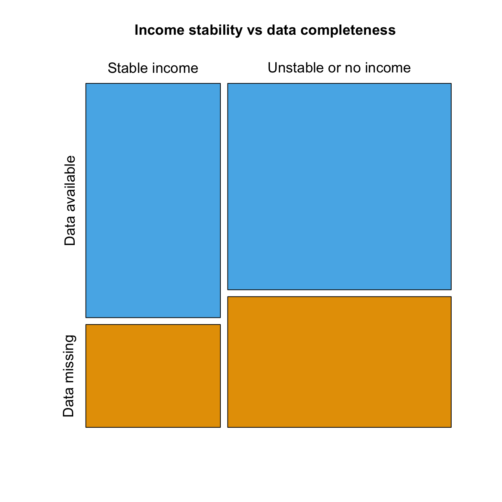

Dropout predictors
================
Peter Kamerman and Tory Madden

Description
-----------

We assessed four baseline (week 0) predictors of dropout (employment/stable income, depression, study group allocation, and sex) from the study at week 8, with week 8 being 2 weeks after the completion of the 6 week programme.

**Note: Participant consent did not provide for the publication of their data, and hence neither the original nor cleaned data have been made available. However, we do not wish to bar access to the data unnecessarily and we will judge requests to access the data on a case-by-case basis. Examples of potential use cases include independent assessments of our analyses, and secondary data analyses. Please contact Prof Romy Parker (<romy.parker@uct.ac.za>), Dr Antonia Wadley (<antonia.wadley@wits.ac.za>), or open an [*issue*](https://github.com/kamermanpr/HIP-supplement/issues) on this repo.**

Setup
-----

``` r
# Load packages
library(magrittr)
library(tidyverse)
library(broom)
library(coin)
```

    ## Loading required package: survival

``` r
# Set ggplot2 theme
theme_set(new = theme_bw(base_size = 14))

# Set knitr options
knitr::opts_chunk$set(warning = FALSE,
                      message = FALSE,
                      fig.retina = 2,
                      fig.align = 'center',
                      fig.path = '../outputs/figures/dropout-predictors/',
                      fig.width = 7,
                      fig.height = 7)
```

Import data
-----------

``` r
# Get data
## BPI
bpi <- read_rds('../data/bpi.rds') %>% 
    select(ID, Pain_present.Wk8)

## Demographics
demo <- read_rds('../data/demographics.rds') %>% 
    select(ID, Site, Group, Sex, Occupation)

## BDI
bdi <- read_rds('../data/bdi.rds') %>% 
    select(ID, ends_with('BL'))
```

Quick look
----------

``` r
glimpse(bpi)
```

    ## Observations: 160
    ## Variables: 2
    ## $ ID               <chr> "J1", "J3", "J4", "J5", "J6", "J7", "J9", "J1...
    ## $ Pain_present.Wk8 <chr> NA, NA, "Yes", NA, NA, NA, "Yes", "Yes", "Yes...

``` r
glimpse(demo)
```

    ## Observations: 160
    ## Variables: 5
    ## $ ID         <chr> "J1", "J3", "J4", "J5", "J6", "J7", "J9", "J10", "J...
    ## $ Site       <chr> "U1", "U1", "U1", "U1", "U1", "U1", "U1", "U1", "U1...
    ## $ Group      <chr> "P", "T", "P", "P", "P", "T", "T", "T", "P", "T", "...
    ## $ Sex        <chr> "female", "female", "female", "female", "female", "...
    ## $ Occupation <chr> "employed", NA, "employed", "unemployed - looking f...

``` r
glimpse(bdi)
```

    ## Observations: 160
    ## Variables: 22
    ## $ ID                          <chr> "J1", "J3", "J4", "J5", "J6", "J7"...
    ## $ Sadness.BL                  <chr> "1", "3", "0", "0", "2", "1", "0",...
    ## $ Pessimism.BL                <chr> "2", "3", "0", "1", "0", "0", "0",...
    ## $ Past_failures.BL            <chr> "2", "3", "0", "2", "1", "0", "0",...
    ## $ Loss_of_pleasure.BL         <chr> "2", "2", "1", "3", "2", "0", "1",...
    ## $ Guilty_feelings.BL          <chr> "2", "3", "0", "0", "1", "3", "0",...
    ## $ Punishment_feelings.BL      <chr> "3", "3", "0", "3", "3", "0", "0",...
    ## $ Self_dislike.BL             <chr> "1", "2", "0", "1", "1", "0", "0",...
    ## $ Self_critical.BL            <chr> "3", "3", "0", "3", "0", "0", "3",...
    ## $ Suicidal.BL                 <chr> "3", "1", "0", "0", "1", "0", "0",...
    ## $ Crying.BL                   <chr> "3", "1", "0", "0", "2", "2", "3",...
    ## $ Agitation.BL                <chr> "3", "1", "3", "2", "3", "3", "3",...
    ## $ Loss_of_interest.BL         <chr> "3", "1", "0", "1", "1", "0", "3",...
    ## $ Indecisiveness.BL           <chr> "2", "2", "0", "3", "2", "0", "1",...
    ## $ Worthlessness.BL            <chr> "2", "3", "1", "2", "2", "0", "0",...
    ## $ Loss_of_energy.BL           <chr> "1", "1", "0", "1", "0", "0", "2",...
    ## $ Sleep.BL                    <chr> "3", "0", "2", "1", "1", "2", "2",...
    ## $ Irritability.BL             <chr> "2", "3", "0", "1", "2", "3", "1",...
    ## $ Appetite.BL                 <chr> "1", "1", "0", "2", "0", "2", "0",...
    ## $ Concentration_difficulty.BL <chr> "3", "1", "0", "2", "1", "0", "2",...
    ## $ Fatigue.BL                  <chr> "2", "0", "0", "1", "0", "2", "1",...
    ## $ Loss_of_interest_in_sex.BL  <chr> "2", "1", "1", "3", "3", "2", "1",...

Clean data
----------

``` r
############################################################
#                                                          #
#                           BPI                            #
#                                                          #
############################################################
# Recode whether there is pain data at week 8 (data completeness)
bpi %<>% 
    select(ID, Pain_present.Wk8) %>% 
    mutate(coding = ifelse(is.na(Pain_present.Wk8), 
                           yes = 'Data missing',
                           no = 'Data available')) %>% 
    select(-Pain_present.Wk8)

############################################################
#                                                          #
#                       Demographics                       #
#                                                          #
############################################################
# Mutate new column to reclassify employment status into income grouping
# Employment status was recoded as stable income (employed or on a grant) 
# or unstable income (all other categories, including being a student).
demo %<>%
    mutate(income_stability = case_when(
        Occupation == "employed" | 
            Occupation == "unable to work - disability grant" ~ "Stable income",
        Occupation == "student/volunteer" | 
            Occupation == "unemployed - looking for work" | 
            Occupation == "unemployed - not looking for work" ~ "Unstable or no income"
        )) %>% 
    select(ID, Site, Group, Sex, income_stability)

# Join with completeness ('bpi') data
demo %<>% 
    left_join(bpi)

############################################################
#                                                          #
#                           BDI                            #
#                                                          #
############################################################
# Calculate BDI total score
bdi %<>% 
    mutate_at(.vars = 2:22,
              .funs = as.integer) %>%
    mutate(Total.BL = rowSums(.[2:22])) 

# Join with demo to get site info
bdi %<>%
    left_join(demo) %>%
    select(ID, Site, Total.BL)

# Convert total BDI scores into categories 
## Site U1 used BDI II
## Site U2, R1, and R2 used BDI I
bdi %<>% 
    mutate(bdi_category = case_when(
    Site == "U1" & Total.BL <= 13 ~ "none-minimal",
    Site == "U1" & Total.BL > 13 & Total.BL <= 19 ~ "mild",
    Site == "U1" & Total.BL > 19 & Total.BL <= 28 ~ "moderate-severe",
    Site == "U1" & Total.BL > 28 ~ "severe",
    Site != "U1" & Total.BL <= 9 ~ "none-minimal",
    Site != "U1" & Total.BL > 9 & Total.BL <= 18 ~ "mild",
    Site != "U1" & Total.BL > 18 & Total.BL <= 29 ~ "moderate-severe",
    Site != "U1" & Total.BL > 29 ~ "severe"))

# Convert bdi category into an ordered factor
bdi %<>% mutate(bdi_category = factor(bdi_category, 
                                      levels = c("none-minimal", 
                                                 "mild", 
                                                 "moderate-severe", 
                                                 "severe"), 
                                      ordered = TRUE))
# Drop Site column
bdi %<>% 
    select(-Site)

# Join with completeness ('bpi') data
bdi %<>% 
    left_join(bpi)
```

Employment/income stability
---------------------------

#### Tabulate

*(no stratification)*

``` r
demo %>% group_by(income_stability) %>%
    summarise(count = n()) %>% 
    knitr::kable(.,
                 caption = 'Access to stable income',
                 col.names = c('', 'Count'))
```

|                       |  Count|
|-----------------------|------:|
| Stable income         |     59|
| Unstable or no income |     98|
| NA                    |      3|

#### Null hypothesis significance testing (NHST)

``` r
# xtabulate the data
employ <- xtabs(~ income_stability + coding, 
                data = demo)

# Produce mosaic plot
mosaicplot(employ,
           main = 'Income stability vs data completeness',
           xlab = '',
           ylab = '',
           cex = 1.2, 
           color = c('#56B4E9', '#E69F00'))
```



``` r
# Fishers exact test
knitr::kable(tidy(fisher.test(employ)),
             caption = 'Association between income stability and data completeness',
             col.names = c('Estimate', 'p-value', 
                           'Lower 95% CI', 'Upper 95% CI',
                           'Method', 'Alternative'),
             digits = 3)
```

|  Estimate|  p-value|  Lower 95% CI|  Upper 95% CI| Method                             | Alternative |
|---------:|--------:|-------------:|-------------:|:-----------------------------------|:------------|
|     1.439|    0.309|         0.691|         3.067| Fisher's Exact Test for Count Data | two.sided   |

Depression and anxiety
----------------------

#### Tabulate

*(no stratification)*

``` r
bdi %>% group_by(bdi_category) %>%
    summarise(count = n()) %>% 
    knitr::kable(.,
                 caption = 'BDI severity category',
                 col.names = c('', 'Count'))
```

|                 |  Count|
|-----------------|------:|
| none-minimal    |     28|
| mild            |     35|
| moderate-severe |     39|
| severe          |     39|
| NA              |     19|

#### Null hypothesis significance testing (NHST)

``` r
# xtabulate the data
depression <- xtabs(~ bdi_category + coding, 
                    data = bdi)

# Produce mosaic plot
mosaicplot(depression,
           main = 'Depression severity vs data completeness',
           xlab = '',
           ylab = '',
           cex = 1.2, 
           color = c('#56B4E9', '#E69F00'))
```


``` r
# Logistic regression on ordered independent variable 
model <- glm(factor(coding) ~ bdi_category, 
             data = bdi, 
             family = binomial(link = "logit"))

# Model summary
car::Anova(model)
```

    ## Analysis of Deviance Table (Type II tests)
    ## 
    ## Response: factor(coding)
    ##              LR Chisq Df Pr(>Chisq)   
    ## bdi_category     11.4  3    0.00975 **
    ## ---
    ## Signif. codes:  0 '***' 0.001 '**' 0.01 '*' 0.05 '.' 0.1 ' ' 1

``` r
# Model summary
summary(model)
```

    ## 
    ## Call:
    ## glm(formula = factor(coding) ~ bdi_category, family = binomial(link = "logit"), 
    ##     data = bdi)
    ## 
    ## Deviance Residuals: 
    ##    Min      1Q  Median      3Q     Max  
    ## -1.070  -1.028  -0.771   1.289   2.114  
    ## 
    ## Coefficients:
    ##                Estimate Std. Error z value Pr(>|z|)    
    ## (Intercept)    -0.95047    0.21406  -4.440 8.99e-06 ***
    ## bdi_category.L  1.40543    0.47717   2.945  0.00323 ** 
    ## bdi_category.Q -0.47716    0.42812  -1.115  0.26504    
    ## bdi_category.C -0.05176    0.37266  -0.139  0.88954    
    ## ---
    ## Signif. codes:  0 '***' 0.001 '**' 0.01 '*' 0.05 '.' 0.1 ' ' 1
    ## 
    ## (Dispersion parameter for binomial family taken to be 1)
    ## 
    ##     Null deviance: 176.6  on 140  degrees of freedom
    ## Residual deviance: 165.2  on 137  degrees of freedom
    ##   (19 observations deleted due to missingness)
    ## AIC: 173.2
    ## 
    ## Number of Fisher Scoring iterations: 4

``` r
# Print odds ratios
ci <- exp(confint(model))[-1]
oddR <- data_frame('Item' = names(exp(coef(model))[-1]),
                   'Odds ratio' = round(exp(coef(model))[-1], 3),
                   'Lower 95% CI' = round(ci[1:3], 3),
                   'Upper 95% CI' = round(ci[4:6], 3))

knitr::kable(oddR,
             caption = 'Odds ratio of regression coefficients')
```

| Item            |  Odds ratio|  Lower 95% CI|  Upper 95% CI|
|:----------------|-----------:|-------------:|-------------:|
| bdi\_category.L |       4.077|         1.718|         0.575|
| bdi\_category.Q |       0.621|         0.252|        11.754|
| bdi\_category.C |       0.950|         0.452|         1.393|

Study group allocation
----------------------

#### Tabulate

*(no stratification)*

``` r
demo %>% group_by(Group) %>%
    summarise(count = n()) %>% 
    knitr::kable(.,
                 caption = 'Study group allocation',
                 col.names = c('', 'Count'))
```

|     |  Count|
|-----|------:|
| P   |     88|
| T   |     72|

#### Null hypothesis significance testing (NHST)

``` r
# xtabulate the data
group <- xtabs(~ Group + coding,  
               data = demo)

# Produce mosaic plot
mosaicplot(group,
           main = 'Study group allocation vs data completeness',
           xlab = 'Study group',
           ylab = '',
           cex = 1.2, 
           color = c('#56B4E9', '#E69F00'))
```


``` r
# Fishers exact test
knitr::kable(tidy(fisher.test(employ)),
             caption = 'Association between study group allocation and data completeness',
             col.names = c('Estimate', 'p-value', 
                           'Lower 95% CI', 'Upper 95% CI',
                           'Method', 'Alternative'),
             digits = 3)
```

|  Estimate|  p-value|  Lower 95% CI|  Upper 95% CI| Method                             | Alternative |
|---------:|--------:|-------------:|-------------:|:-----------------------------------|:------------|
|     1.439|    0.309|         0.691|         3.067| Fisher's Exact Test for Count Data | two.sided   |

Sex
---

#### Tabulate

*(no stratification)*

``` r
demo %>% group_by(Sex) %>%
    summarise(count = n()) %>% 
    knitr::kable(.,
                 caption = 'Sex',
                 col.names = c('', 'Count'))
```

|        |  Count|
|--------|------:|
| female |     97|
| male   |     63|

#### Null hypothesis significance testing (NHST)

``` r
# xtabulate the data
sex <- xtabs(~ Sex + coding,  
               data = demo)

# Produce mosaic plot
mosaicplot(sex,
           main = 'Sex vs data completeness',
           xlab = '',
           ylab = '',
           cex = 1.2, 
           color = c('#56B4E9', '#E69F00'))
```


``` r
# Fishers exact test
knitr::kable(tidy(fisher.test(employ)),
             caption = 'Association between sex and data completeness',
             col.names = c('Estimate', 'p-value', 
                           'Lower 95% CI', 'Upper 95% CI',
                           'Method', 'Alternative'),
             digits = 3)
```

|  Estimate|  p-value|  Lower 95% CI|  Upper 95% CI| Method                             | Alternative |
|---------:|--------:|-------------:|-------------:|:-----------------------------------|:------------|
|     1.439|    0.309|         0.691|         3.067| Fisher's Exact Test for Count Data | two.sided   |

Summary
-------

Income stability, sex, and group allocation did not predict whether or not an individual's data were present at 8 weeks. However, depression did: those with greater depression (on BDI) were more likely to have been lost to follow-up at the 8-week time point (main effect of depression severity: likelihood ratio = 11.31, df = 3, p = 0.01; OR for linear component of logistic regression = 4.01, 95% CI = 1.68 - 11.59).

Manuscript plot
---------------

Plot of proportion of participants with missing data at each level of depression severity, as rated on the Beck's Depression Inventory. Numbers in the blocks show the absolute counts.

**Note:** 19 participants are missing baseline BDI data, so the total sample is 141.

``` r
# Colour (dark)
p1 <- bdi %>% 
    filter(!is.na(bdi_category)) %>% 
    mutate(bdi_category = fct_recode(bdi_category,
                                     Minimal = 'none-minimal',
                                     Mild = 'mild',
                                     Moderate = 'moderate-severe',
                                     Severe = 'severe'),
           coding = case_when(
               coding == 'Data available' ~ 'Data available   ',
               coding == 'Data missing' ~ 'Data missing    '
               )) %>% 
    ggplot(data = .) +
    aes(bdi_category,
        fill = coding) +
    geom_bar(position = position_fill()) +
    geom_text(stat = 'count',
              position = position_fill(),
              aes(label = ..count..),
              colour = '#FFFFFF',
              vjust = 1.5,
              size = 7.5) +
    labs(x = 'Depression severity',
         y = 'Proportion of participants') +
    scale_x_discrete(expand = c(0, 0)) +
    scale_y_continuous(expand = c(0, 0)) +
    scale_fill_manual(values = c('#0072B2', '#D55E00')) +
    theme_bw(base_size = 26) +
    theme(legend.position = 'top',
          legend.title = element_blank(),
          panel.border = element_blank(),
          panel.grid = element_blank(),
          axis.title.y = element_text(margin = margin(t = 0, r = 20, b = 0, l = 0)),
          axis.title.x = element_text(margin = margin(t = 20, r = 0, b = 0, l = 0)),
          axis.text = element_text(colour = '#000000'),
          axis.line = element_blank(),
          axis.ticks = element_blank())

p1
```


``` r
ggsave(filename = '../outputs/figures/dropout-predictors/figure-2_colourA.pdf',
       height = 8, width = 10, units = 'in')

# Colour (light)
p2 <- bdi %>% 
    filter(!is.na(bdi_category)) %>% 
    mutate(bdi_category = fct_recode(bdi_category,
                                     Minimal = 'none-minimal',
                                     Mild = 'mild',
                                     Moderate = 'moderate-severe',
                                     Severe = 'severe'),
           coding = case_when(
               coding == 'Data available' ~ 'Data available   ',
               coding == 'Data missing' ~ 'Data missing    '
               )) %>% 
    ggplot(data = .) +
    aes(bdi_category,
        fill = coding) +
    geom_bar(position = position_fill()) +
    geom_text(stat = 'count',
              position = position_fill(),
              aes(label = ..count..),
              colour = '#000000',
              vjust = 1.5,
              size = 7.5) +
    labs(x = 'Depression severity',
         y = 'Proportion of participants') +
    scale_x_discrete(expand = c(0, 0)) +
    scale_y_continuous(expand = c(0, 0)) +
    scale_fill_manual(values = c('#56B4E9', '#E69F00')) +
    theme_bw(base_size = 26) +
    theme(legend.position = 'top',
          legend.title = element_blank(),
          panel.border = element_blank(),
          panel.grid = element_blank(),
          axis.title.y = element_text(margin = margin(t = 0, r = 20, b = 0, l = 0)),
          axis.title.x = element_text(margin = margin(t = 20, r = 0, b = 0, l = 0)),
          axis.text = element_text(colour = '#000000'),
          axis.line = element_blank(),
          axis.ticks = element_blank())

p2
```


``` r
ggsave(filename = '../outputs/figures/dropout-predictors/figure-2_colourB.pdf',
       height = 8, width = 10, units = 'in')

# Greyscale
p3 <- bdi %>% 
    filter(!is.na(bdi_category)) %>% 
    mutate(bdi_category = fct_recode(bdi_category,
                                     Minimal = 'none-minimal',
                                     Mild = 'mild',
                                     Moderate = 'moderate-severe',
                                     Severe = 'severe'),
           coding = case_when(
               coding == 'Data available' ~ 'Data available   ',
               coding == 'Data missing' ~ 'Data missing    '
               )) %>% 
    ggplot(data = .) +
    aes(bdi_category,
        fill = coding) +
    geom_bar(position = position_fill()) +
    geom_text(stat = 'count',
              position = position_fill(),
              aes(label = ..count..),
              colour = '#000000',
              vjust = 1.5,
              size = 7.5) +
    labs(x = 'Depression severity',
         y = 'Proportion of participants') +
    scale_x_discrete(expand = c(0, 0)) +
    scale_y_continuous(expand = c(0, 0)) +
    scale_fill_manual(values = c('#888888', '#BFBFBF')) +
    theme_bw(base_size = 26) +
    theme(legend.position = 'top',
          legend.title = element_blank(),
          panel.border = element_blank(),
          panel.grid = element_blank(),
          axis.title.y = element_text(margin = margin(t = 0, r = 20, b = 0, l = 0)),
          axis.title.x = element_text(margin = margin(t = 20, r = 0, b = 0, l = 0)),
          axis.text = element_text(colour = '#000000'),
          axis.line = element_blank(),
          axis.ticks = element_blank())

p3
```


``` r
ggsave(filename = '../outputs/figures/dropout-predictors/figure-2_greyscale.pdf',
       height = 8, width = 10, units = 'in')
```

Session information
-------------------

    ## R version 3.4.4 (2018-03-15)
    ## Platform: x86_64-apple-darwin15.6.0 (64-bit)
    ## Running under: macOS High Sierra 10.13.4
    ## 
    ## Matrix products: default
    ## BLAS: /System/Library/Frameworks/Accelerate.framework/Versions/A/Frameworks/vecLib.framework/Versions/A/libBLAS.dylib
    ## LAPACK: /Library/Frameworks/R.framework/Versions/3.4/Resources/lib/libRlapack.dylib
    ## 
    ## locale:
    ## [1] en_GB.UTF-8/en_GB.UTF-8/en_GB.UTF-8/C/en_GB.UTF-8/en_GB.UTF-8
    ## 
    ## attached base packages:
    ## [1] stats     graphics  grDevices utils     datasets  methods   base     
    ## 
    ## other attached packages:
    ##  [1] coin_1.2-2         survival_2.41-3    broom_0.4.4       
    ##  [4] tableone_0.9.2     bindrcpp_0.2.2     skimr_1.0.2       
    ##  [7] magrittr_1.5       forcats_0.3.0      stringr_1.3.0     
    ## [10] dplyr_0.7.4        purrr_0.2.4        readr_1.1.1       
    ## [13] tidyr_0.8.0        tibble_1.4.2       ggplot2_2.2.1.9000
    ## [16] tidyverse_1.2.1    readxl_1.0.0       usethis_1.3.0     
    ## [19] devtools_1.13.5   
    ## 
    ## loaded via a namespace (and not attached):
    ##  [1] nlme_3.1-137        littleboxes_0.1.0   lubridate_1.7.4    
    ##  [4] RColorBrewer_1.1-2  httr_1.3.1          rprojroot_1.3-2    
    ##  [7] tools_3.4.4         backports_1.1.2     utf8_1.1.3         
    ## [10] R6_2.2.2            lazyeval_0.2.1      colorspace_1.3-2   
    ## [13] withr_2.1.2         tidyselect_0.2.4    mnormt_1.5-5       
    ## [16] curl_3.2            compiler_3.4.4      cli_1.0.0          
    ## [19] rvest_0.3.2         xml2_1.2.0          sandwich_2.4-0     
    ## [22] labeling_0.3        scales_0.5.0.9000   mvtnorm_1.0-7      
    ## [25] psych_1.8.3.3       digest_0.6.15       foreign_0.8-69     
    ## [28] rmarkdown_1.9       rio_0.5.10          pkgconfig_2.0.1    
    ## [31] htmltools_0.3.6     labelled_1.0.1      highr_0.6          
    ## [34] rlang_0.2.0         rstudioapi_0.7      bindr_0.1.1        
    ## [37] zoo_1.8-1           jsonlite_1.5        car_3.0-0          
    ## [40] modeltools_0.2-21   Matrix_1.2-14       Rcpp_0.12.16       
    ## [43] munsell_0.4.3       abind_1.4-5         stringi_1.1.7      
    ## [46] multcomp_1.4-8      yaml_2.1.18         carData_3.0-1      
    ## [49] MASS_7.3-49         plyr_1.8.4          grid_3.4.4         
    ## [52] parallel_3.4.4      crayon_1.3.4        lattice_0.20-35    
    ## [55] haven_1.1.1         splines_3.4.4       pander_0.6.1       
    ## [58] hms_0.4.2           knitr_1.20          pillar_1.2.1       
    ## [61] reshape2_1.4.3      codetools_0.2-15    stats4_3.4.4       
    ## [64] glue_1.2.0          evaluate_0.10.1     data.table_1.10.4-3
    ## [67] modelr_0.1.1        cellranger_1.1.0    gtable_0.2.0       
    ## [70] assertthat_0.2.0    openxlsx_4.0.17     survey_3.33-2      
    ## [73] e1071_1.6-8         rsconnect_0.8.8     class_7.3-14       
    ## [76] memoise_1.1.0       TH.data_1.0-8
